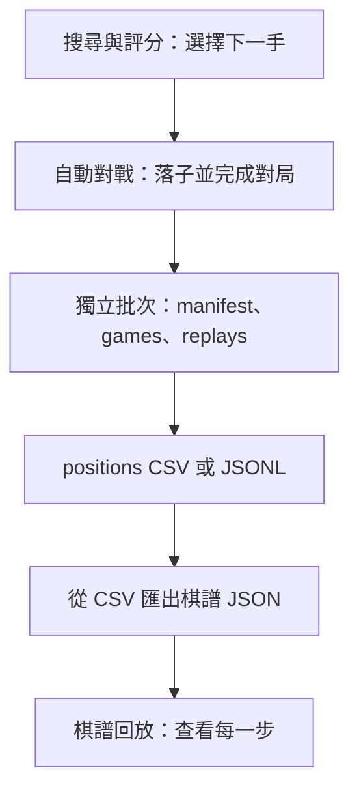

# Chess AI

以 Python 開發的西洋棋 AI 實驗專案。棋規與合法走法使用 `chess` 套件，專案自行實作選步策略、局面評分、自動對戰及棋譜回放。

整理日期：2026-09-09。文件依目前實作整理；「已實作」不代表所有情境或棋力都已驗證。

## 文件導覽

| 區塊 | 主要責任 | 目前進度 |
| --- | --- | --- |
| [自動對戰](docs/自動對戰.md) | 讓整盤棋跑完，設定對戰雙方與黑白輪替、統計、輸出資料 | 已有精簡 v2 批次保存、CLI 多程序生成與 UI 批次進度 |
| [評分調整與實驗](docs/評分調整與實驗.md) | 獨立權重、手動比較與未來調參策略 | 舊 ML 已移除；獨立權重與比較流程待實作 |
| [搜尋與評分](docs/搜尋與評分.md) | 決定每一步怎麼選，包含 Greedy、Alpha-Beta、子力與 PST | 搜尋核心已實作，尚未接入對戰 CLI；時間限制未生效 |
| [使用者介面（UI）](docs/使用者介面.md) | 棋盤顯示、使用者操作與對局查找 | 已有高解析度模式首頁、批次生成、真人對 AI、日期／批次／對局回放 |

後續任務順序與驗收以 [開發計畫](docs/開發計畫.md) 為準；測試分類與執行方式見 [測試導覽](tests/README.md)。四份功能文件區分目前實作與未來規劃。

**2026-09-09 P1 完成：** 已移除舊 ML 程式、訓練入口、模型與專屬參數；對戰 CLI 提供 Random 基準及原有 material。保留 PNG 備援與通用對局資料；P2 測試分類也已完成，後續 P3–P7 尚未實作。

## 各區塊怎麼串接？

以下為目前的對局資料與回放流程。



資料產生器與 UI 使用 Random / Greedy，對戰 CLI 使用 Random 或搭配子力評分器的 Greedy。Alpha-Beta 可在 Python 中使用，但尚未加入既有 CLI 選項。

## 共用棋規與資料分類規劃

以下接點、批次格式與日期回放查找已完成：

- **共用棋規**：底層維持 `chess.Board`，`engine/game.py` 提供棋盤建立、合法走法、落子、終局與結果。自動對戰、真人落子、棋譜載入與回放已接入，未改搜尋演算法或評分權重。
- **歷史保存**：回放保留完整走法堆疊，跳步後可由 `current_board()`、`current_outcome()`／`current_result()` 取得帶歷史的局面與結果；FEN 快取僅供顯示。搜尋分支原有的 `copy(stack=False)` 限制仍保留，詳見搜尋文件。
- **棋規與執行設定分開**：預設不自動申請和棋；生成可用 `--claim-draw` 開啟，政策保存於批次與棋譜。`--max-plies` 是執行上限，截斷記為 `status=truncated`、`result=*`，不當作和棋。
- **批次是保存單位**：每次生成建立 `data/batches/<日期_流水號>/`，內含 `manifest.json`、`games.csv`、`positions.csv` 或 JSONL，以及各盤回放 JSON。schema v2 以 manifest 管設定／進度、games 管每盤時間／一次種子、回放 JSON 管走法、positions 管逐手局面。名稱與標籤選填，移除雜湊與空預留欄位；UI 已可依日期 → 批次／非批次 → 對局查找。
- **舊資料保留**：不搬移舊檔；生成器預設只寫新批次，明確指定 `--output <新檔名>` 可另外輸出原八欄逐手資料，若檔案已存在則拒絕覆寫。CSV／JSONL 生成與 CSV 棋譜匯出保留，回放仍使用 `--replay`。

共用核心的使用方式見 [自動對戰](docs/自動對戰.md#共用棋規規劃) 與 [UI](docs/使用者介面.md#共用棋規規劃)；批次格式以 [自動對戰的批次資料規劃](docs/自動對戰.md#批次資料規劃) 為主要說明。

## 目前做到哪裡？

目前包含一手 Greedy、可替換評分器的多步搜尋，以及先前已完成的批次保存與 UI 回放流程。詳見 [搜尋與評分的目前進度](docs/搜尋與評分.md#目前進度)。

- 先前里程碑 `857566d`（2026-04-14）：`優化可讀性`。
- 先前里程碑 `e61e93a`（2026-04-13）：`有UI，generate資料後可執行play_ui來觀看`。
- 現有 `dataset.csv` 有 1,000 盤、179,059 筆局面；資料統計見 [自動對戰](docs/自動對戰.md#目前進度與限制)。

## 目錄用途

| 目錄／檔案 | 責任 | 想改什麼時來看 |
| --- | --- | --- |
| `engine/` | 棋盤操作、玩家策略、評分、自動對戰與回放狀態 | AI 怎麼決定下一步、局面怎麼評分 |
| `engine/search/` | 多步搜尋及搜尋介面 | 搜尋深度、剪枝、時間限制 |
| `scripts/` | 可從命令列執行的工作流程 | 產生資料、匯出棋譜、比較引擎 |
| `apps/play_ui.py` | UI 啟動與既有回放輔助函式 | 一般啟動首頁或指定 --replay |
| `apps/chess_application.py` | 首頁、對戰／回放畫面及事件控制 | 操作流程、暫停、真人輸入、確認與匯出 |
| `engine/batch_run.py`、`engine/replay_catalog.py` | 背景批次進度、日期與對局查找 | 批次暫停／停止、回放選單 |
| `engine/data_ids.py` | 台北時間與持久每日流水號 | 新資料命名與避免覆寫 |
| `engine/live_session.py` | 單盤即時狀態與背景 AI 選步協調 | 棋局生命週期、回合限制與終局 |
| `ui/` | 棋盤、走法列表、對局資訊的畫面呈現 | 顯示方式、配色、排列與捲動 |
| `assets/pieces/` | 12 張既有 PNG 備援；UI 優先以 python-chess SVG 原生渲染 | 棋子外觀 |
| `data/batches/` | 每次生成的描述檔、對局摘要、逐手資料與棋譜；Git 忽略 | 檢查或分享一批對局 |
| `data/replays/` | JSON 棋譜範例與本機匯出棋譜 | 想回看一盤棋 |
| `tests/` | `unittest` 自動化測試 | 確認搜尋、評分與回放邏輯 |
| `experiments.json` | 三組棋子價值設定與 `num_games: 20` | 舊的權重實驗設定；目前沒有程式讀取它 |
| `dataset.csv` | 本機產生的逐步對局資料 | 通用逐手紀錄與匯出棋譜的輸入 |
| `temp.py` | 被 Git 忽略的回放 UI 暫存程式 | 草稿參考；正式入口在 `apps/play_ui.py` |
| `tools/` | 本次檢查為空目錄 | 暫無實作 |
| `.vscode/` | 編輯器設定，指定 Conda 環境管理偏好 | 開發工具設定，不代表 Conda 環境已存在 |
| `.uv-python/`、`.uv-cache/`、`__pycache__/` | 本機 Python、套件快取與編譯快取 | 執行環境相關，非棋力邏輯 |

各目錄的 `__init__.py` 主要將目錄標記為 Python 套件；`engine/search/__init__.py` 另外集中匯出搜尋類別與型別。

## 環境設定

以下 PowerShell 指令都從專案根目錄執行。專案目前沒有 `requirements.txt`、`pyproject.toml` 或套件鎖定檔；依 import 可確認直接使用的第三方套件為 `chess`、`pygame`。

### 建立環境

2026-09-08 排查指令錯誤時，已在這台電腦建立 `.venv` 並安裝依賴。日常執行直接使用下方快速開始指令即可，不需啟用環境。`.venv` 不納入 Git，換電腦或刪除環境後仍需重新建立。

需要重建時，以下指令使用本機已安裝的 `uv` 與專案內的 Python：

```powershell
Set-Location D:\Python\chess-ai
uv venv .venv --python "./.uv-python/cpython-3.12.13-windows-x86_64-none/python.exe"
uv pip install --python "./.venv/Scripts/python.exe" chess pygame
```

此 Python 路徑是本機配置，其他電腦需指定可用的 Python。套件版本目前未鎖定。

### PowerShell 指令注意事項

- `& "./.venv/Scripts/python.exe"` 表示執行目前專案虛擬環境內的 Python；`&` 是 PowerShell 呼叫運算子。
- 路徑中的 `./` 代表目前目錄，`.venv` 是資料夾名稱；不要寫成 `..venv`。
- 請從程式碼區塊直接複製指令；模組名稱寫 `scripts.generate_dataset`，底線前不加反斜線。
- 可執行 `Test-Path "./.venv/Scripts/python.exe"` 確認環境存在；若回傳 `False`，先檢查所在目錄或建立環境。

## 快速開始

啟動 UI，從首頁選擇批次自動對戰、真人下棋或棋譜回放：

```powershell
& "./.venv/Scripts/python.exe" -m apps.play_ui
```

預設視窗 **1280×960**，支援調整大小與 Windows DPI；字型及 SVG 棋子依目前尺寸重新渲染。

自動對戰只需設定白方、黑方、**場間間隔**及場次，開始後顯示進度條、目前第幾場與已保存數量；支援暫停／繼續／停止。每盤自動保存，停止當盤結果為 `*`，不算和棋。UI 固定白黑配置，CLI 仍交替顏色。

回放流程是**日期 → 批次或非批次 → 對局 → 播放**，顯示對手、時間與對戰編號。綠色「勝」跟隨勝方，中性「敗／和」及琥珀「未完成」分開表示；尚未判定輾壓或略勝。

真人模式仍可選執白／黑，點棋子與合法目的格落子、選擇升變。結束或停止後可保存至 `data/replays/<日期_流水號>.json`，歸在非批次；同局不重複保存。對局日期在開始時記錄。`--replay` 仍可直接開既有棋譜。詳細操作見 [UI 文件](docs/使用者介面.md)。

產生小批次（2 盤、最多各 12 手，用於檢查輸出）：

```powershell
& "./.venv/Scripts/python.exe" -m scripts.generate_dataset --games 2 --workers 2 --seed 42 --max-plies 12 --batch-name "輸出驗證" --tag smoke
```

省略 `--max-plies` 會跑到棋規終局。生成器會印出新批次路徑；其中 `replays/<日期_流水號>.json` 可直接交給 `--replay`，也可從 UI 日期選單查找。逐手局面資料請使用 `positions.csv`／JSONL，不是摘要 `games.csv`。

先看範例回放：

```powershell
& "./.venv/Scripts/python.exe" -m apps.play_ui --replay data/replays/sample_replay.json
```

其餘指令依工作區塊查閱：

- [產生資料、比較引擎與匯出棋譜](docs/自動對戰.md#執行方式)
- [權重與實驗規劃](docs/評分調整與實驗.md#特徵與權重規劃)
- [直接使用 Alpha-Beta](docs/搜尋與評分.md#使用方式)
- [開啟指定棋譜](docs/使用者介面.md#執行方式)

## 驗證紀錄

P2 已將測試分類至 rules、evaluation、search、self_play、replay、ui，並抽出共用 ManualExecutor。原有 88 個案例 ID 全數保留、搬移的 test 方法內容不變；新增 discovery 驗證後 **89 個測試全部通過**，`git diff --check` 通過。測試命令需加 `-t .` 避免 `tests/ui` 與正式 `ui` 匯入衝突。

P1 移除 2 個 ML 專屬案例，保留原有非 ML 覆蓋，新增 6 個對戰 CLI 測試；完整測試共 **88 個通過**，`git diff --check` 通過。涵蓋 Random／material 兩盤完整對戰、黑白輪替、A 視角結果、種子重現及舊選項拒絕。執行方式見 [測試導覽](tests/README.md)。以下為先前功能提交紀錄，不代表本次重新執行了實體畫面驗證。

2026-09-09：完整專案共 **82 個測試通過**。涵蓋共用棋規與歷史、正常終局／截斷、批次 ID／數量／路徑、同時分配流水號、CSV／JSONL、單／多程序重現、停止／失敗保存、跨午夜分類、舊格式與單檔訓練相容、真人落子及視窗縮放。

已建立 `.venv` 時：

```powershell
& "./.venv/Scripts/python.exe" -m unittest discover -s tests -t . -v
```

使用目前依賴的隔離環境指令：

```powershell
uv run --no-project --python .uv-python/cpython-3.12.13-windows-x86_64-none/python.exe --with chess --with pygame python -m unittest discover -s tests -t . -v
```

先前功能提交另以 UI 真實背景執行緒完成 2 場正常終局，共 220 筆局面；CLI 驗證 2 場截斷 JSONL，共 24 筆。識別碼、數量、相對路徑、逐手 FEN、回放結果與依種子重跑均比對一致。畫面檢查包含設定、進度、日期回放清單、真人棋盤與高解析度渲染。

未重訓模型、修改評分權重或搜尋演算法；既有搜尋／評分檔案與原測試經 SHA256 比對未變。`git diff --check` 通過。實體桌面跨螢幕 DPI、其他平台字型／輸入法及大批次效能仍待實測；`scripts/test.py` 仍是特定 FEN 的手動除錯工具。

## 建議接續順序

依 [開發計畫](docs/開發計畫.md) 執行：P1 移除舊 ML（已完成）→ P2 測試分類（已完成）→ P3 engine 分類 → P4 獨立權重及設定保存 → P5 比較流程 → P6 特徵／搜尋逐項擴充 → P7 評估自動調參。

本次完成 P2 測試分類；下一階段為 P3 engine 分類，需另行安排。每階段依 AGENTS.md 完成相關測試、全部驗證與獨立 commit，並更新文件狀態。

目前 UI 真人模式、自動對戰與日期回放已完成，保留現有功能；名稱／標籤搜尋、悔棋、索引快取及中斷修復另行安排。資源圖片與舊對局資料本輪不清理。
