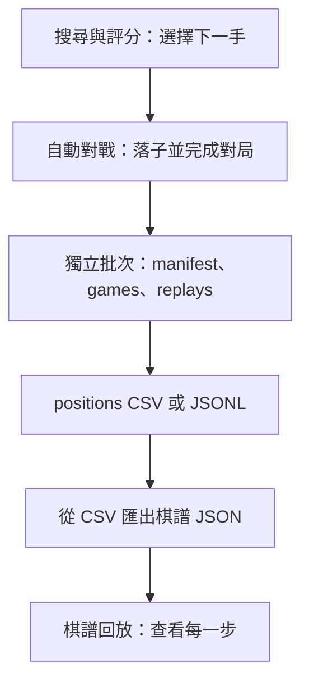

# Chess AI

以 Python 開發的西洋棋 AI 實驗專案。棋規與合法走法使用 `chess` 套件，專案自行實作選步策略、局面評分、自動對戰及棋譜回放。

整理日期：2026-09-10。文件依目前實作整理；「已實作」不代表所有情境或棋力都已驗證。

## 文件導覽

| 區塊 | 主要責任 | 目前進度 |
| --- | --- | --- |
| [自動對戰](docs/自動對戰.md) | 讓整盤棋跑完，設定對戰雙方與黑白輪替、統計、輸出資料 | 已有精簡 v2 批次保存、CLI 多程序生成與 UI 批次進度 |
| [評分調整與實驗](docs/評分調整與實驗.md) | 獨立權重、手動比較與未來調參策略 | 可調設定與成對交換黑白比較流程已完成 |
| [搜尋與評分](docs/搜尋與評分.md) | 決定每一步怎麼選，包含 Greedy、Alpha-Beta、子力與 PST | 搜尋核心、時間／取消、置換表與 PVS／aspiration 已實作，尚未接入對戰 CLI |
| [使用者介面（UI）](docs/使用者介面.md) | 棋盤顯示、使用者操作與對局查找 | 已有共用批次生成、真人對 AI 與統一「對局紀錄」查找、設定檢視及回放 |

後續任務順序與驗收以 [開發計畫](docs/開發計畫.md) 為準；測試分類與執行方式見 [測試導覽](tests/README.md)。四份功能文件區分目前實作與未來規劃。

**2026-10-01 P1–P5、P6/S0–S4、S5/PVS、aspiration 與 E1–E5 完成：** 已移除舊 ML，完成測試／engine 分類、版本化評分設定、成對比較批次、終局／歷史正確性、基本 move ordering、quiescence、迭代加深與時間／取消、含歷史隔離的置換表，以及 PVS／aspiration 窄窗搜尋與可選的中局／殘局平滑評分、兵形、活動力、國王安全與棋子協調特徵。Random 基準、PNG 備援與通用對局資料保留。

## 各區塊怎麼串接？

以下為目前的對局資料與回放流程。



資料產生器與 UI 使用 Random / Greedy，對戰 CLI 使用 Random 或搭配子力評分器的 Greedy。Alpha-Beta 可在 Python 中使用，但尚未加入既有 CLI 選項。

## 共用棋規與資料分類規劃

以下接點、批次格式與日期回放查找已完成：

- **共用棋規**：底層維持 `chess.Board`，`engine/game.py` 提供棋盤建立、合法走法、落子、終局與結果。自動對戰、真人落子、棋譜載入與回放已接入，未改搜尋演算法或評分權重。
- **歷史保存**：回放保留完整走法堆疊，跳步後可由 `current_board()`、`current_outcome()`／`current_result()` 取得帶歷史的局面與結果；FEN 快取僅供顯示。P6/S0 後搜尋與 Greedy 分支也保留完整 move stack，重複局面沿用對局的申請和棋政策。
- **棋規與執行設定分開**：預設不自動申請和棋；生成可用 `--claim-draw` 開啟，政策保存於批次與棋譜。`--max-plies` 是執行上限，截斷記為 `status=truncated`、`result=*`，不當作和棋。
- **批次是保存單位**：每次生成建立 `data/batches/<日期_流水號>/`，內含 `manifest.json`、`games.csv`、`positions.csv` 或 JSONL，以及各盤回放 JSON。schema v2 以 manifest 管設定／進度、games 管每盤時間／一次種子、回放 JSON 管走法、positions 管逐手局面。名稱與標籤選填，移除雜湊與空預留欄位；UI 由「對局紀錄」統一查找比較、一般批次與非批次棋譜，可按日期篩選。
- **舊資料保留**：不搬移舊檔；生成器預設只寫新批次，明確指定 `--output <新檔名>` 可另外輸出原八欄逐手資料，若檔案已存在則拒絕覆寫。CSV／JSONL 生成與 CSV 棋譜匯出保留，回放仍使用 `--replay`。

共用核心的使用方式見 [自動對戰](docs/自動對戰.md#共用棋規規劃) 與 [UI](docs/使用者介面.md#共用棋規規劃)；批次格式以 [自動對戰的批次資料規劃](docs/自動對戰.md#批次資料規劃) 為主要說明。

## 目前做到哪裡？

目前包含一手 Greedy、可替換評分器的多步搜尋，以及先前已完成的批次保存與 UI 回放流程。詳見 [搜尋與評分的目前進度](docs/搜尋與評分.md#目前進度)。

- 先前里程碑 `857566d`（2026-04-14）：`優化可讀性`。
- 先前里程碑 `e61e93a`（2026-04-13）：`有UI，generate資料後可執行play_ui來觀看`。

## 目錄用途

| 目錄／檔案 | 責任 | 想改什麼時來看 |
| --- | --- | --- |
| `engine/` | 棋盤操作、玩家策略、評分、自動對戰與回放狀態 | AI 怎麼決定下一步、局面怎麼評分 |
| `engine/evaluation/` | 子力與 PST 評分 | 評分器與棋子位置表 |
| `engine/sessions/` | 自動對戰、即時對局、背景批次 | 對局生命週期與批次控制 |
| `engine/replay/` | 棋譜載入、回放狀態與目錄查找 | 回放驗證、跳步及日期索引 |
| `engine/storage/` | 批次資料保存與每日流水號 | schema、檔案輸出及唯一編號 |
| `engine/search/` | 多步搜尋及搜尋介面 | 搜尋深度、剪枝、時間限制 |
| `scripts/` | 可從命令列執行的工作流程 | 產生資料、匯出棋譜、比較引擎 |
| `configs/evaluation/` | 穩定設定與未驗證的比較範例 | 建立或選擇手工評分比較設定 |
| `apps/play_ui.py` | UI 啟動與既有回放輔助函式 | 一般啟動首頁或指定 --replay |
| `apps/chess_application.py` | 首頁、對戰／回放畫面及事件控制 | 操作流程、暫停、真人輸入、確認與匯出 |
| `engine/sessions/batch_execution.py`、`engine/replay/records_catalog.py` | 共用背景批次控制、日期與對局查找 | 模式派發、暫停／停止、紀錄查找 |
| `engine/storage/data_ids.py` | 台北時間與持久每日流水號 | 新資料命名與避免覆寫 |
| `engine/sessions/live_session.py` | 單盤即時狀態與背景 AI 選步協調 | 棋局生命週期、回合限制與終局 |
| `ui/` | 棋盤、走法列表、對局資訊的畫面呈現 | 顯示方式、配色、排列與捲動 |
| `assets/pieces/` | 12 張既有 PNG 備援；UI 優先以 python-chess SVG 原生渲染 | 棋子外觀 |
| `data/batches/` | 每次生成的描述檔、對局摘要、逐手資料與棋譜；Git 忽略 | 檢查或分享一批對局 |
| `data/replays/` | JSON 棋譜範例與本機匯出棋譜 | 想回看一盤棋 |
| `tests/` | `unittest` 自動化測試 | 確認搜尋、評分與回放邏輯 |
| `experiments.json` | 三組棋子價值設定與 `num_games: 20` | 舊的權重實驗設定；目前沒有程式讀取它 |
| `dataset.csv` | 本機產生的逐步對局資料 | 通用逐手紀錄與匯出棋譜的輸入 |
| `temp.py` | 被 Git 忽略的回放 UI 暫存程式 | 草稿參考；正式入口在 `apps/play_ui.py` |
| `tools/` | 本次檢查為空目錄 | 暫無實作 |
| `.vscode/` | 編輯器設定，指定 Conda 環境管理偏好 | 開發工具設定，不代表 Conda 環境已存在 |
| `.uv-python/`、`.uv-cache/`、`__pycache__/` | 本機 Python、套件快取與編譯快取 | 執行環境相關，非棋力邏輯 |

P3 將 Python 匯入路徑統一為 `engine.evaluation.*`、`engine.sessions.*`、`engine.replay.*`、`engine.storage.*`，不保留舊平鋪模組別名；CLI 使用方式不變。P4 的 `engine/evaluation/config.py` 定義可序列化設定與分項結果，預設仍為原本的 material + PST。

各目錄的 `__init__.py` 主要將目錄標記為 Python 套件；`engine/search/__init__.py` 另外集中匯出搜尋類別與型別。

## 環境設定

以下 PowerShell 指令都從專案根目錄執行。專案目前沒有 `requirements.txt`、`pyproject.toml` 或套件鎖定檔；依 import 可確認直接使用的第三方套件為 `chess`、`pygame`。

### 建立環境

2026-09-08 排查指令錯誤時，已在這台電腦建立 `.venv` 並安裝依賴。日常執行直接使用下方快速開始指令即可，不需啟用環境。`.venv` 不納入 Git，換電腦或刪除環境後仍需重新建立。

需要重建時，以下指令使用本機已安裝的 `uv` 與專案內的 Python：

```powershell
Set-Location D:\Python\chess-ai
uv venv .venv --python "./.uv-python/cpython-3.12.13-windows-x86_64-none/python.exe"
uv pip install --python "./.venv/Scripts/python.exe" chess pygame
```

此 Python 路徑是本機配置，其他電腦需指定可用的 Python。套件版本目前未鎖定。

### PowerShell 指令注意事項

- `& "./.venv/Scripts/python.exe"` 表示執行目前專案虛擬環境內的 Python；`&` 是 PowerShell 呼叫運算子。
- 路徑中的 `./` 代表目前目錄，`.venv` 是資料夾名稱；不要寫成 `..venv`。
- 請從程式碼區塊直接複製指令；模組名稱寫 `scripts.generate_dataset`，底線前不加反斜線。
- 可執行 `Test-Path "./.venv/Scripts/python.exe"` 確認環境存在；若回傳 `False`，先檢查所在目錄或建立環境。

## 快速開始

啟動 UI，從首頁選擇批次自動對戰、真人下棋或對局紀錄：

```powershell
& "./.venv/Scripts/python.exe" -m apps.play_ui
```

預設視窗 **1280×960**，支援調整大小與 Windows DPI；字型及 SVG 棋子依目前尺寸重新渲染。

批次自動對戰是統一生成入口：**一般對戰**設定固定白黑玩家、場次與場間間隔，可暫停／繼續；**評分比較**設定基準／候選、相同 Alpha-Beta 固定深度、開局集與種子，每對交換黑白。兩者共用「同時對戰場數」（初始 4，可手動調整），實際程序數依 CPU 與工作數限制。一般每個工作跑一局，比較每個工作依序跑兩局交換黑白，不同配對並行，每場搜尋維持單執行緒。共用背景派發、進度、停止、錯誤處理與逐局保存，停止當盤以 `*` 保留，不算和棋；評分比較目前不提供暫停。CLI 原有一般對戰的交替顏色行為不變。

耗時與吞吐量可用 `python -m tools.benchmark_batches` 比較同一有限工作量的 1／4／8 個 worker；預設一般 16 局、比較 8 組配對、每局最多 12 手、搜尋深度 2，包含程序啟動與保存成本，使用暫存批次，不覆寫既有資料。

「對局紀錄」共用日期查找、分頁、設定摘要與回放：比較批次保留候選／基準差異與完整配對統計，一般批次顯示白勝／和／黑勝與未完成，非批次只顯示保存資料，缺少設定或耗時標示未記錄。缺漏比較摘要仍可查看已保存棋局，但不套用比較統計；回放返回保留來源與位置。「新增比較」沿用批次設定捷徑，預選評分比較。

回放流程是**日期 → 批次或非批次 → 對局 → 播放**，顯示對手、時間與對戰編號。綠色「勝」跟隨勝方，中性「敗／和」及琥珀「未完成」分開表示；尚未判定輾壓或略勝。

真人模式仍可選執白／黑，點棋子與合法目的格落子、選擇升變。結束或停止後可保存至 `data/replays/<日期_流水號>.json`，歸在非批次；同局不重複保存。對局日期在開始時記錄。`--replay` 仍可直接開既有棋譜。詳細操作見 [UI 文件](docs/使用者介面.md)。

產生小批次（2 盤、最多各 12 手，用於檢查輸出）：

```powershell
& "./.venv/Scripts/python.exe" -m scripts.generate_dataset --games 2 --workers 2 --seed 42 --max-plies 12 --batch-name "輸出驗證" --tag smoke
```

省略 `--max-plies` 會跑到棋規終局。生成器會印出新批次路徑；其中 `replays/<日期_流水號>.json` 可直接交給 `--replay`，也可從 UI 日期選單查找。逐手局面資料請使用 `positions.csv`／JSONL，不是摘要 `games.csv`。

先看範例回放：

```powershell
& "./.venv/Scripts/python.exe" -m apps.play_ui --replay data/replays/sample_replay.json
```

其餘指令依工作區塊查閱：

- [產生資料、比較引擎與匯出棋譜](docs/自動對戰.md#執行方式)
- [權重與實驗規劃](docs/評分調整與實驗.md#特徵與權重規劃)
- [直接使用 Alpha-Beta](docs/搜尋與評分.md#使用方式)
- [開啟指定棋譜](docs/使用者介面.md#執行方式)

## 驗證紀錄

2026-10-06 P5 比較流程接入 Alpha-Beta 固定深度：API／CLI 支援相同搜尋設定的評分比較，保存實際 evaluator、搜尋設定與一般深度預算，保留 Greedy 預設與 Random 基準。comparison schema v2，不變更通用批次／回放格式。新增 10 個整合案例後完整 **227 個測試全部通過**，`git diff --check` 通過；固定時間、UI／engine_match 整合及棋力實驗仍待後續工作。使用方式見 [Alpha-Beta 比較](docs/評分調整與實驗.md#alpha-beta-固定深度比較)。

P6/E5 新增可選異色格雙象獎勵及車的互斥開放／半開放檔獎勵。升變象按格色覆蓋計分，雙象每方最多一份；同檔車逐枚計分。各項預設關閉、獨立中局／殘局權重，schema v6 相容 v1–v5。新增 12 個案例並更新 P5 保存／CLI 驗證，完整 **217 個測試全部通過**，`git diff --check` 通過。E1–E5 功能已完成，棋力效果仍待對戰驗證；定義與範例見 [棋子協調評分](docs/搜尋與評分.md#e5-棋子協調評分)。

P6/E4 新增可選兵盾、王區受攻擊格數與半開放／開放檔暴露評分。只用當前王位，不依易位權推測歷史；各項獨立中局／殘局權重，預設全關且殘局權重為零，啟用 E1 時平滑淡出並保留殘局王活動。schema v5 相容 v1–v4。新增 13 個案例並更新 P5 保存／CLI 驗證，完整 **205 個測試全部通過**，`git diff --check` 通過；棋力效果待對戰驗證。範例與限制見 [國王安全評分](docs/搜尋與評分.md#e4-國王安全評分)。

P6/E3 新增六棋種的攻擊空間活動力：逐枚累加幾何攻擊目的格，排除己方占據格，固定白方減黑方；不做合法走法／安全過濾，釘住與受將仍按幾何攻擊計分。各項獨立開關與中局／殘局權重，預設全關；schema v4 相容 v1–v3。新增 12 個案例並更新 P5 保存／CLI 驗證，完整 **192 個測試全部通過**，`git diff --check` 通過。棋力效果待對戰驗證；範例與限制見 [活動力評分](docs/搜尋與評分.md#e3-活動力評分)。

P6/E2 新增可選孤兵、每檔額外疊兵及最前方通路兵評分；通路兵依相對第 2–7 排給 1–6 推進單位。各項有獨立中局／殘局權重與開關，沿用 E1 混合；schema v3 保存特徵版本與權重，仍讀取 v1／v2，預設三項關閉。新增 15 個案例並更新 P5 保存與 CLI 驗證，完整 **180 個測試全部通過**，`git diff --check` 通過。此為功能驗收，棋力效果待對戰驗證；範例及限制見 [兵形評分](docs/搜尋與評分.md#e2-兵形評分)。

P6/E1 新增可選分階段評分：依 N/B=1、R=2、Q=4 的剩餘子力單位（初始 24）混合中局／殘局各自加權的分數；殘局 PST v1 僅改國王中央活動。設定 schema v2 保存兩階段權重與表／階段模型版本，仍讀取 v1；預設關閉以維持既有評分。分項輸出包含階段比例與兩階段原始值／貢獻。新增 10 個案例並更新 P5 批次／CLI 保存驗證，完整 **165 個測試全部通過**，`git diff --check` 通過；此為功能驗收，尚未證明棋力提升。可比較設定見 [分階段評分](docs/搜尋與評分.md#e1-分階段評分)。

P6/S5 第二小段新增 root aspiration window：depth 2 起預設以上一輪完整分數正負 1 pawn 搜尋，fail-high／fail-low 或等於邊界即完整重搜；可用 `aspiration_window=None` 停用，重搜中止仍回傳上一完整深度。新增 7 個案例後完整 **155 個測試全部通過**，`git diff --check` 通過。固定 depth 3 戰術回歸維持 `d1g4` 與 -5 分，節點由 427 降至 423；差距很小，不視為普遍加速或棋力證明。

P6/S5 第一小段新增 PVS：每個一般節點第一手走完整視窗，後續走法以相鄰浮點邊界 scout，只有改善但未 cutoff 時完整重搜；可關閉作標準 Alpha-Beta 基準，結果另提供 scout／重搜統計。新增 5 個案例後完整 **148 個測試全部通過**，`git diff --check` 通過。固定 depth 3、關閉 quiescence／TT 的戰術回歸維持 `d1g4` 與 -5 分，節點由 483 降至 455；該小段未混入 aspiration、LMR 或 Null move，也不把單一案例當成棋力證明。

P6/S4 新增單次 `search()` 置換表，保存深度、最佳走法、分數與 EXACT／LOWER／UPPER 界限；key 納入五十回合計數、可逆歷史及 root ply，避免混用重複和棋與不同將死距離。每次公開搜尋建立新表，設定變更後不沿用舊值，亦可關閉作基準。新增 13 個案例後完整 **143 個測試全部通過**，`git diff --check` 通過；這一階段驗證快取正確性，不宣稱棋力提升。

P6/S3 實作逐深度迭代加深、有效的 `time_ms` 與 `stop_requested` 合作式取消。搜尋結果分開保存最後完整 `completed_depth` 和包含未完成迭代／quiescence 的 `depth_reached`；停止時回傳上一輪完整結果，尚無完整輪次則回傳合法 depth 0 備援。新增 5 個案例後完整 **130 個測試全部通過**，`git diff --check` 通過；20 ms 實際 smoke 約 20.1 ms 返回、完成 depth 2 並探索至 depth 3，根棋盤不變。P5 比較 CLI 尚未新增 fixed-time budget mode。

P6/S2 在一般深度邊界延伸吃子／升變，受將時搜尋全部合法應將，並以預設 4 ply 加受將時一層最終應對定義有限停止邊界。depth 1 驗收局面成功看見吃車後后會被回吃。新增 6 個案例後完整 **125 個測試全部通過**，`git diff --check` 通過；未加入一般 checking moves、時間控制或評分變更。

P6/S1 加入可關閉的升變／吃子基本 move ordering；固定 depth 3 驗收局面維持相同最佳走法與分數，節點由 1,529 降至 411，本機單次約 0.048 秒降至 0.013 秒。新增 5 個案例後完整 **119 個測試全部通過**，`git diff --check` 通過；時間不作自動門檻，也不宣稱每個局面都加速。

P6/S0 統一 Alpha-Beta／Greedy 終局計分與 `claim_draw` 政策，搜尋分支保留 move stack，並把對局規則傳入各 Greedy 建構入口。新增 9 個案例後完整 **114 個測試全部通過**，`git diff --check` 通過；涵蓋將死優先、可申請三次重複、分支五次重複，以及正常／異常後根棋盤不變。未改權重、增加新評分特徵或實作 `time_ms`。

P5 新增設定比較批次：每個初始局面以相同 pair seed 跑兩盤並交換 baseline／candidate 黑白，完整保存設定、固定深度預算、配對、結果、耗時及未完成統計。新增 7 個案例後完整 **105 個測試全部通過**，`git diff --check` 通過；小樣本只驗證流程，不代表棋力提升。

P4 新增版本化 `EvaluationConfig`、PST 倍率／開關、逐項 breakdown，並讓 CLI 批次、UI 批次及真人對局從實際注入的 evaluator 保存完整設定。預設評分與 PST 表未變；新增 7 個驗收案例後，完整 **98 個測試全部通過**，`git diff --check` 通過。

P3 已分類 10 個 engine 模組並同步所有專案引用；原有 Python 程式經匯入／patch 路徑正規化後 AST 一致，89 個既有案例保留。新增獨立程序匯入與 CLI 多程序生成／匯出回放驗證後，**91 個測試全部通過**，`git diff --check` 通過。目錄分類不改棋規、評分、搜尋與資料格式。

P2 已將測試分類至 rules、evaluation、search、self_play、replay、ui，並抽出共用 ManualExecutor。原有 88 個案例 ID 全數保留、搬移的 test 方法內容不變；新增 discovery 驗證後 **89 個測試全部通過**，`git diff --check` 通過。測試命令需加 `-t .` 避免 `tests/ui` 與正式 `ui` 匯入衝突。

P1 移除 2 個 ML 專屬案例，保留原有非 ML 覆蓋，新增 6 個對戰 CLI 測試；完整測試共 **88 個通過**，`git diff --check` 通過。涵蓋 Random／material 兩盤完整對戰、黑白輪替、A 視角結果、種子重現及舊選項拒絕。執行方式見 [測試導覽](tests/README.md)。以下為先前功能提交紀錄，不代表本次重新執行了實體畫面驗證。

2026-09-09：完整專案共 **82 個測試通過**。涵蓋共用棋規與歷史、正常終局／截斷、批次 ID／數量／路徑、同時分配流水號、CSV／JSONL、單／多程序重現、停止／失敗保存、跨午夜分類、舊格式與單檔訓練相容、真人落子及視窗縮放。

已建立 `.venv` 時：

```powershell
& "./.venv/Scripts/python.exe" -m unittest discover -s tests -t . -v
```

使用目前依賴的隔離環境指令：

```powershell
uv run --no-project --python .uv-python/cpython-3.12.13-windows-x86_64-none/python.exe --with chess --with pygame python -m unittest discover -s tests -t . -v
```

先前功能提交另以 UI 真實背景執行緒完成 2 場正常終局，共 220 筆局面；CLI 驗證 2 場截斷 JSONL，共 24 筆。識別碼、數量、相對路徑、逐手 FEN、回放結果與依種子重跑均比對一致。畫面檢查包含設定、進度、日期回放清單、真人棋盤與高解析度渲染。

未重訓模型、修改評分權重或搜尋演算法；既有搜尋／評分檔案與原測試經 SHA256 比對未變。`git diff --check` 通過。實體桌面跨螢幕 DPI、其他平台字型／輸入法及大批次效能仍待實測；`scripts/test.py` 仍是特定 FEN 的手動除錯工具。

## 建議接續順序

後續依 [開發計畫](docs/開發計畫.md) 逐組驗證評分棋力，再接入固定時間比較；兩種模式已共用多程序批次並行，每場搜尋仍維持單執行緒；吞吐量依工作量與啟動／保存成本而異，不保證線性加速。搜尋設定比較與統計分析按需求安排。

以 UI 作為主要操作入口，共用現有規則、比較及保存流程；一次只驗證一組評分變更。程式改動依 AGENTS.md 完成相關測試、驗證與獨立 commit，文件由使用者人工檢閱。

目前 UI 真人模式、自動對戰與日期回放已完成，保留現有功能；名稱／標籤搜尋、悔棋、索引快取及中斷修復另行安排。資源圖片與舊對局資料本輪不清理。
