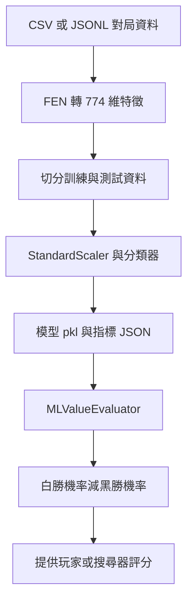

# 機器學習

[回到專案總覽](../README.md)

整理日期：2026-09-09。依目前實作整理。

## 用途

負責把對局資料轉為特徵、訓練局面勝負模型，再將模型包裝為 AI 可呼叫的評分器。目前學的是「由局面預測整盤最終勝負」，不是直接預測下一手。資料如何產生見 [自動對戰](自動對戰.md)。

## 相關檔案

| 檔案 | 作用 |
| --- | --- |
| `training/features.py` | FEN 轉數值特徵，勝負字串轉標籤 |
| `training/train_value_model.py` | 讀資料、切分、訓練、評估、輸出模型 |
| `scripts/train_value_model.py` | 轉呼叫訓練程式的命令列入口 |
| `engine/ml_evaluator.py` | 載入模型並回傳白方視角評分 |
| `training/value_model.pkl` | 本機已保存的模型 |
| `training/value_model_metrics.json` | 本機舊實驗報告 |

## 運作流程



每盤所有局面都使用該盤最終結果作為標籤：白勝 `1`、和棋 `0`、黑勝 `-1`。CSV 欄位定義見 [自動對戰的輸出資料格式](自動對戰.md#輸出資料格式)。

## 特徵與模型

`training/features.py` 將棋盤轉為 774 維數值：12 種顏色／棋種 × 64 格，共 768 維；再加輪到哪方、四個王車易位權、標準化半回合計數共 6 維。沒有額外編碼吃過路兵目標格或重複局面歷史。

`training/train_value_model.py` 讀 CSV / JSONL，使用 `StandardScaler` 與分類器 Pipeline；可選 Logistic Regression 或 RidgeClassifier，並輸出 accuracy、混淆矩陣、分類報告與重要特徵。`scripts/train_value_model.py` 只是轉呼叫它的命令列入口。

目前有兩個值得先處理的接點：

1. 訓練允許 `ridge`，但 `MLValueEvaluator` 要求 `predict_proba()`；RidgeClassifier 產物不能直接給目前的 ML 對戰入口使用。
2. 訓練／測試以「資料列」隨機切分，同一盤的局面可能出現在兩邊。若要評估對新對局的泛化，應改以 `game_id` 分組切分。

## 模型如何接回 AI

`engine/ml_evaluator.py` 的 `MLValueEvaluator` 預設載入 `training/value_model.pkl`，呼叫 `predict_proba()`，回傳「白勝機率 − 黑勝機率」。`MLEvaluator` 是它的相容別名。

若模型接受較少特徵，會截取向量的前 N 維；若模型要求更多特徵則報錯。此處的局面評分固定使用白方視角，分數尺度是機率差，與子力分數不同。

對戰 CLI 的 `ml` 選項目前將模型注入 `GreedyPlayer`；Alpha-Beta 也可在 Python 中注入相同評分器，但 CLI 尚未串接。選步與終局計分分工見 [搜尋與評分](搜尋與評分.md)。

## 目前進度與本機成果

本次直接統計 `dataset.csv`：**179,059 列、1,000 盤**（編號 1–1000）；白勝 129 盤、黑勝 119 盤、和棋 752 盤。資料列中和棋標籤為 140,094 列，約 78.24%。

本機已有 `training/value_model.pkl` 與 `training/value_model_metrics.json`。後者記錄的是：

| 指標 | 報告內容 |
| --- | --- |
| 資料列數 | 90,389 |
| 特徵數 | 30 |
| 模型 | logistic |
| class_weight | balanced |
| 訓練／測試筆數 | 72,311 / 18,078 |
| 多數類別基準 accuracy | 約 77.91% |
| 模型 accuracy | 約 29.91% |

這份報告與目前 179,059 列的 CSV 不吻合，而且目前程式預設使用 774 維、`class_weight=None`。**應將它視為舊實驗紀錄，不能當成現在程式重新訓練後的成績，也不能單靠 accuracy 判定棋力。** 報告沒有保存資料雜湊或程式版本，無法只靠檔名確認模型、報告與現有 CSV 的對應關係。

`--max-features 30` 會取向量最前面 30 維，不是挑出最重要的 30 維；依現在的特徵順序，這只涵蓋白兵平面的一部分。

## 執行方式

以下 PowerShell 指令從專案根目錄執行，並假設已依 [README 的環境設定](../README.md#環境設定) 建立 `.venv`。

先準備 CSV 或 JSONL，資料產生指令見 [自動對戰](自動對戰.md)。以下使用新的輸出檔名保留舊模型：

```powershell
& "./.venv/Scripts/python.exe" -m scripts.train_value_model --dataset sample_dataset.csv --model logistic --model-out training/review_value_model.pkl --metrics-out training/review_value_model_metrics.json
```

訓練至少需要兩種結果類別，小資料主要用來確認流程。若重跑相同輸出檔名，會覆寫模型與報告。模型與 metrics 被 `.gitignore` 排除。

訓練後可依 [自動對戰](自動對戰.md#執行方式) 的 `engine_match` 指令比較實際結果。

## 驗證範圍與建議下一步

目前 `test_evaluator_semantics.py` 僅確認 ML 別名相容，沒有驗證現有模型推論、完整訓練流程或棋力。2026-09-08 的專案盤點沒有重新訓練或覆寫模型。

1. 以 `game_id` 分組切分訓練／測試，減少同盤局面跨集合的問題。
2. 保存資料雜湊、特徵版本、套件版本與完整訓練參數。
3. 使用可輸出機率的 logistic 完成新實驗，或另行解決 ridge 與評分器的介面差異。
4. 同時比較多數類別基準、各類別指標與實際對戰結果。

## 與批次資料規劃的關係

**批次保存與讀入相容調整已完成：** 每次生成以批次資料夾保存，`games.csv` 是每盤摘要，逐手訓練輸入則為 `positions.csv` 或描述檔指定的 JSONL。完整格式見 [自動對戰](自動對戰.md#批次資料規劃)。目前訓練程式仍直接讀指定 CSV / JSONL，不會自動掃描批次描述檔。

`load_rows()` 對 CSV／JSONL 排除 `result=*` 或 `status` 非 completed 的資料列，並印出排除數量；舊資料沒有 status 時按結果判斷。全數未完成或空資料會給出明確錯誤。`result_to_target()` 維持只接受三種正式結果，不把截斷當和棋。其餘特徵、分類器、權重、資料切分及訓練策略均未改動。

例如 `--dataset data/batches/<批次資料夾>/positions.csv` 可沿用現有訓練命令；勿指定 games.csv。新 v2 的 game_id 是共用資料根目錄內唯一的日期流水號字串，不能再一律轉 int；若混用 v1 資料，跨批次識別仍需使用 `batch_id + game_id`。v2 的種子只在 games 保存，策略設定在 manifest，逐手 positions 不再重複種子；既有單檔訓練不依賴這些欄位。目前沒有批次合併、manifest 掃描或分組切分功能。本次驗證混合結果 CSV／JSONL 的讀入、排除及 774 維特徵，未重新訓練或覆寫模型。
