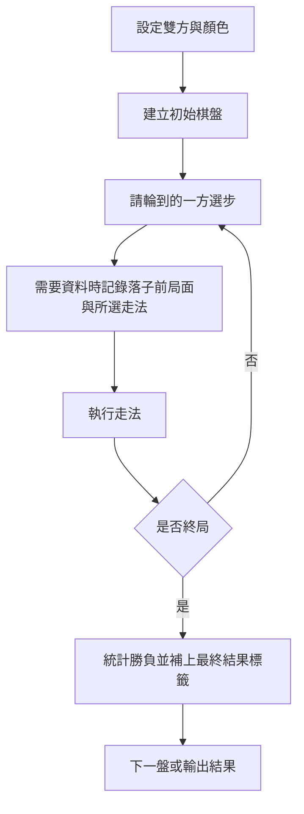

# 自動對戰

[回到專案總覽](../README.md)

整理日期：2026-09-09。依目前實作整理。

## 用途

負責讓一盤棋自動跑到結束：設定對戰雙方與黑白輪替、依序請 AI 選步、落子、判斷終局，最後統計勝負或輸出資料。每一步如何選，交由 [搜尋與評分](搜尋與評分.md) 中的玩家策略處理。

## 相關檔案

| 檔案 | 作用 |
| --- | --- |
| `engine/game.py` | 建立棋盤、列出合法走法、驗證後落子、判斷結束；棋規交給 `chess.Board` |
| `engine/self_play.py` | 可重用的批次對戰與逐步資料收集函式 |
| `engine/live_session.py` | 真人對 AI 的單盤狀態、背景選步、暫停與停止 |
| `scripts/generate_dataset.py` | 多程序執行 Random / Greedy，生成獨立批次與選擇性的單檔輸出 |
| `engine/batch_run.py` | UI 背景批次、固定白黑方、場間間隔、暫停與停止 |
| `engine/data_ids.py` | 台北日期時間、跨程序共用的每日流水號 |
| `engine/strategy_config.py` | 集中保存目前策略名稱與實際子力權重 |
| `engine/batch_storage.py` | 批次 schema v2、對局索引、逐手資料、回放與生成狀態保存 |
| `scripts/engine_match.py` | 比較子力評分與 ML 評分的 Greedy AI，輸出引擎 A 視角的勝／和／敗 |
| `scripts/export_replay_json.py` | 從 CSV 匯出指定一盤的 JSON 棋譜 |
| `dataset.csv` | 本機對局資料，未納入 Git |
| `experiments.json` | 舊的棋子權重實驗設定，目前沒有程式讀取 |

## 對戰雙方設定與黑白輪替

這裡的「玩家」指 AI 策略。UI 可分別選白方與黑方 Random／Greedy，同批固定顏色，不自動交換。CLI 資料產生器保留原本 Random 對 Greedy 的輪替行為：

| 局數 | 白方 | 黑方 |
| --- | --- | --- |
| 奇數局 | RandomPlayer | GreedyPlayer |
| 偶數局 | GreedyPlayer | RandomPlayer |

對戰 CLI 也會讓引擎 A / B 交替顏色。`material` 與 `ml` 選項都使用 `GreedyPlayer`，差別在評分器。

資料產生器的 `GreedyPlayer()` 預設使用子力＋PST；對戰 CLI 的 `material` 則明確只使用子力評分，兩個入口的設定不同。

## 運作流程



`engine/self_play.py` 提供可重用函式：

- `run_batch_matches()`：玩家 A/B 交替執白黑，回傳每盤結果與總統計。
- `collect_self_play_data()`：另外記錄每手走之前的 FEN、輪到哪方、所選走法，結束後補上勝負標籤。
- `GameRecord`、`MoveRecord`、`BatchResult`：上述既有 API 的資料結構。
- `play_game()`／`PlayedGame`：提供新生成器使用的單盤收集流程，保存初始／最終 FEN、逐手資料、結果與截斷原因。舊批次 API 保持既有簽名及統計行為。

`scripts/generate_dataset.py` 使用 `ProcessPoolExecutor.map` 逐盤派工、按 game_id 順序保存；單程序可用 `--workers 1`。每盤經 `engine/self_play.play_game()` 呼叫共用棋規，正常終局優先於執行上限。預設仍為 Random 對 Greedy，奇偶局交換顏色。原 `play_single_game()`／`worker_run_games()` 的逐手回傳介面保留。

## 輸出資料格式

| CSV 欄位 | 意義 |
| --- | --- |
| `game_id` | 對局編號 |
| `ply` | 這盤第幾手，從 1 開始 |
| `fen` | 這一手落子前的完整局面字串 |
| `side_to_move` | `white` 或 `black` |
| `selected_move` | UCI 格式走法，例如 `e2e4` |
| `result` | 整盤最終結果：`1-0`、`0-1`、`1/2-1/2`；執行截斷為 `*` |
| `white_player`、`black_player` | 對局雙方標籤 |

上表為原八欄單檔格式；批次 positions 另帶 `batch_id`、`status`、`termination`、`claim_draw`，不再逐手保存種子。CSV 的布林欄位寫為 `True`／`False`，JSONL 使用原生布林。

每列記錄落子前的局面；整盤結束後，將最終結果填回這盤的所有資料列。機器學習如何使用這些標籤，見 [機器學習](機器學習.md)。

## 棋譜輸出與後續用途

`scripts/export_replay_json.py` 從 CSV 篩選 `game_id`，依 `ply` 排序，輸出 `initial_fen`、`moves_uci`、`result`、`metadata`，並轉帶可選批次 ID、種子、狀態與申請和棋政策。仍只讀 CSV；批次生成時已直接保存各盤 JSON（含零手對局），通常不必另行匯出。舊八欄 CSV 沒有申請和棋政策，重新匯出時使用預設政策；請以批次原生棋譜保留完整 metadata。

- CSV / JSONL 可交給 [機器學習](機器學習.md) 訓練。
- 匯出的 JSON 可交給 [使用者介面（UI）](使用者介面.md) 顯示；格式與讀取細節見該文件。

## 目前進度與限制

已實作自動落子、黑白輪替、批次統計、多程序產生資料與單盤棋譜匯出。2026-09-08 盤點的 `dataset.csv` 有 **179,059 列、1,000 盤**（編號 1–1000）：白勝 129 盤、黑勝 119 盤、和棋 752 盤。

- Alpha-Beta 尚未接到對戰 CLI 或資料產生器的選項。
- 產生器預設依 CPU 數開多程序，可指定 `--workers`；未指定 `--max-plies` 時不設執行手數上限。
- 舊批次 API 保留原迴圈及呼叫方式，與新生成流程共用必要棋規入口；未擴充舊 API 的生成選項。
- 批次與回放往返已加入自動化測試；大批次效能、斷電／強制結束復原及續跑未實作。
- 生成資料與多數匯出棋譜被 `.gitignore` 排除，新 clone 不會帶回它們。

## 共用棋規規劃

**狀態：必要接點已完成。** 自動對戰、棋譜載入、回放驗證及 SAN 列表建立均經 `engine/game.py`，底層繼續使用 `chess.Board`。

| 共用核心 | 對戰執行層 |
| --- | --- |
| `create_board(initial_fen)` 建立棋盤 | 選擇 AI、評分器與黑白輪替 |
| `get_legal_moves()`／`make_move()` 驗證並落子 | 請玩家選步、記錄逐手資料 |
| `get_outcome()`／`get_result()`／`is_game_over()` 判定棋規終局 | 管理盤數、手數上限、統計與檔案 |

棋盤推進保留 move stack；`ReplaySession` 保留一份完整棋盤歷史，`current_board()` 複製後回退至指定 ply，FEN 快取不參與終局判定。相同初始 FEN、走法序列及 `claim_draw` 政策得到相同結果。單一 FEN 無法恢復開始位置以前的歷史。搜尋分支原有的歷史遺失問題本次未改，詳見 [搜尋與評分](搜尋與評分.md#與共用棋規的關係)。

`claim_draw=False` 為既有預設，三次重複／五十步不自動申請；五次重複、七十五步等自動終局仍生效。`--claim-draw` 使用 python-chess 的可申請政策，包含「宣告下一手即可成立」的和棋，因此可能在尚未實際走出第三次重複前停止。政策存於 `settings.rules` 與回放 `metadata.rules`。

`--max-plies N` 按本次實際落子數計算，不使用 FEN 的 fullmove number。0 可保存初始局面。每輪先檢查棋規終局，再檢查上限；恰於最後允許一手將死仍是正常終局。

## 批次資料規劃

**狀態：schema v2 已實作，UI 已接入批次生成與按日期回放。** 舊 v1 批次及單盤棋譜維持唯讀相容，不自動改名、搬移或覆寫。

```text
data/
├── .sequences.sqlite3          # 同一資料根目錄共用的每日流水號
├── batches/
│   └── 20260909_0001/
│       ├── manifest.json
│       ├── games.csv
│       ├── positions.csv      # CLI 也支援 positions.jsonl
│       └── replays/
│           ├── 20260909_000001.json
│           └── 20260909_000002.json
└── replays/
    └── 20260909_000003.json    # 真人對 AI 的獨立棋譜，按保存操作建立
```

上述編號為格式示例。批次編號是建立日期加至少四位流水號；對局編號是開局日期加至少六位流水號，UI、CLI 與獨立保存共用 `data/.sequences.sqlite3`。SQLite 交易序列化同時分配，重啟不重用號碼；失敗可留下缺號，序號超過寬度會自然延長。首次沒有計數紀錄時會掃描既有日期命名檔案，接續最大號碼。檔案及批次目錄仍排他建立，碰撞時報錯，絕不覆寫。

唯一性範圍是共用同一資料根目錄的生成器；不同電腦／不同根目錄分別生成的同日編號可能重複，目前不提供跨來源合併。自訂 `--batch-root` 使用其父目錄保存計數器。備份整份 data 時請一起保存計數器，避免刪除資料後重用曾發出的號碼。

### manifest.json

| 欄位 | 意義 |
| --- | --- |
| `schema_version`、`batch_id` | 格式版本 2、批次日期流水號；ID 與資料夾名稱一致 |
| `name`、`tags` | 選填；CLI 可設定，未填不寫入；tags 去重且保留順序 |
| `created_at`、`updated_at` | 建立與最後保存進度的時間 |
| `finished_at` | 完成／停止／失敗時才寫入 |
| `status` | generating／completed／stopped／failed；暫停為本次執行中的 UI 狀態，磁碟仍為 generating |
| `error` | 僅失敗時寫入錯誤原因 |
| `settings` | 初始 FEN、rules.claim_draw、workers、color_assignment、雙方策略；有上限才寫 max_plies；UI 另有 interval_seconds |
| `settings.strategies` | UI 使用 white／black；CLI 使用 a／b，依 color_assignment=alternate 輪替。每方以 strategy 保存 Random／Greedy；Greedy 另保存 handcrafted 評分器與實際子力 weights |
| `files` | games、positions 相對路徑；positions 格式依副檔名判斷 |
| `counts` | requested_games、saved_games、completed_games、truncated_games、positions；預計盤數只在此保存 |
| `results` | `1-0`、`0-1`、`1/2-1/2`、`*` 各盤數，供摘要快速顯示 |

不再寫入 source_sha256、pst_sha256、pst_source、runtime、rng、seed_derivation、legacy_export、空參數或 null 預留欄位，也不重複保存 class／label。Greedy 仍使用目前程式內既有 PST，未修改權重或演算法；格式不保存程式與 PST 快照，因此不承諾跨版本重跑一致。

### games.csv 與逐手資料

摘要欄位依序為：

```text
game_id,game_number,started_at,finished_at,white_player,black_player,seed,result,move_count,status,termination,replay_path
```

- `game_id` 是字串日期流水號；`game_number` 是本批第幾場，從 1 開始。雙方名稱對應 manifest 的 strategy；策略參數集中在 manifest。
- 每盤各自記錄 `started_at`、`finished_at`，ISO 8601 帶 `+08:00` 時區。依**開局日期（Asia/Taipei）**分類；同批跨午夜開始的各盤會分別出現在對應日期。不是拿批次建立時間或檔案修改時間冒充對局時間。
- `seed` 僅在 games 每盤保存一次。CLI 仍用命令列 base seed（預設 10000）加 game_number；UI 每盤從系統亂數產生種子。雙方共用該盤 `random.Random(seed)`，相同程式、參數、初始局面與種子可重跑，不受 CLI 程序數影響。
- 正常終局：`status=completed`，termination 為 python-chess 名稱的小寫，例如 checkmate、stalemate、insufficient_material、fivefold_repetition。
- 執行上限：`status=truncated, termination=max_plies, result=*`；UI 主動停止當前棋局則為 truncated／user_stop／*。批次 completed 只表示所有要求場次已生成保存，不保證每盤均為棋規終局。
- `saved_games = completed_games + truncated_games = games.csv 列數 = 回放檔數`；`positions = 各盤 move_count 總和 = 逐手資料列數`。
- `replay_path` 相對批次根目錄。初始 FEN 在批次設定與回放保存；不存 final_fen，依初始局面加走法即可重建。
- positions 保留原八欄及 batch_id／status／termination／claim_draw，支援既有單檔訓練與 CSV 棋譜匯出；不含種子、策略參數或日期。訓練仍只讀指定 positions，不讀 games。
- 零手棋局仍有摘要及空 moves_uci 棋譜，沒有逐手列；這類棋局請使用原生回放 JSON。

### 回放 JSON

每盤保存 `schema_version=2, initial_fen, moves_uci, result, metadata`。批次棋譜 metadata 僅保存 batch_id、game_id、每盤起終時間、白黑方、status、termination、rules。沒有自己的路徑、最終 FEN、種子或整份策略參數；即使單獨複製此 JSON，仍能完整重播與依棋規政策重建結果。要以 AI 重新生成則需 games 中的種子與 manifest 中的參數。

真人對 AI 保存為 `data/replays/<日期流水號>.json`，不產生 manifest、games 或 positions；metadata 另外保存雙方策略參數、seed、interval_seconds，以及非空的上限／失敗原因。日期在按下開始時記錄，不是保存時才補上；finished_at 在終局或停止時記錄。同局重按保存回傳原檔，不重複分配對局編號。

### 寫入與相容性

逐盤先寫棋譜、positions、games，flush 後再以暫存檔替換 manifest，更新已保存數量。可捕捉的單盤寫入失敗會回退該盤列與棋譜，保留之前的對局；AI 失敗則保留已提交對局，manifest 標 failed 並記錄原因，正在失敗的當盤不發布。

UI 在背景執行整批，主執行緒只讀進度快照；暫停與停止在選步前後的走法邊界協作處理。暫停不再套用走法，繼續接續原局；停止會保存當盤已落子的部分，若在場間停止則不建立下一盤。已開始的 AI 計算不會硬性中斷，畫面保持可操作，離開前等保存結束。場間間隔預設 0 秒，暫停期間不計入等待時間。

這不是跨檔案資料庫交易：UI 索引以 manifest.saved_games 為可見前綴，忽略未發布尾端。強制殺程序、斷電或持續磁碟錯誤可能留下 generating、暫存檔或部分尾端；不提供修復或續跑。

舊 dataset.csv、單檔 CSV／JSONL 訓練、`--replay` 均保留。生成器預設只寫新批次；`--output` 額外輸出原八欄單檔，使用原批內數字編號，可透過 games.game_number 對應新 game_id；既有輸出檔會被拒絕覆寫。額外單檔在失敗時可能只含部分對局，以批次 manifest 為準。

UI 只查專案 data/batches 與 data/replays，讀取 v1／v2 索引、選定後載入走法；舊資料沒有每盤日期就列入「日期不詳」。不自動掃描所有 positions，不將 manifest 當單盤棋譜。

## 執行方式

以下 PowerShell 指令從專案根目錄執行，並假設已依 [README 的環境設定](../README.md#環境設定) 建立 `.venv`。

產生小批次（用於輸出驗證；省略上限即可跑至棋規終局）：

```powershell
& "./.venv/Scripts/python.exe" -m scripts.generate_dataset --games 2 --workers 2 --seed 42 --max-plies 12 --batch-name "批次驗證" --tag smoke --tag random-greedy
```

改存 JSONL、使用自訂根目錄及自動申請和棋：

```powershell
& "./.venv/Scripts/python.exe" -m scripts.generate_dataset --games 2 --format jsonl --batch-root data/batches --batch-name "完整對局" --seed 42 --claim-draw
```

產生批次並額外保留舊單檔輸出方式（請用未存在的檔名）：

```powershell
& "./.venv/Scripts/python.exe" -m scripts.generate_dataset --games 20 --format csv --output sample_dataset.csv
```

匯出既有資料的第 1 盤：

```powershell
& "./.venv/Scripts/python.exe" -m scripts.export_replay_json --dataset dataset.csv --game-id 1 --output data/replays/game_1_review.json
```

使用已訓練的模型比較引擎，模型建立方式見 [機器學習](機器學習.md)：

```powershell
& "./.venv/Scripts/python.exe" -m scripts.engine_match --engine-a material --engine-b ml --games 10 --ml-model training/review_value_model.pkl
```

生成器的額外輸出檔名不能重複。JSONL 單檔請指定 `--format jsonl --output sample_dataset.jsonl`；未指定 `--output` 則僅有批次。舊 CSV 棋譜匯出器仍會覆寫其指定的輸出 JSON，使用時請選新名稱。

## 建議下一步

2026-09-09 完整測試共 82 個通過，涵蓋新舊格式、固定與輪替顏色、CSV／JSONL、單／多程序重現、同時分配流水號、跨午夜分類、停止／失敗保存、回放歷史與單檔訓練輸入。執行指令見 [README](../README.md#驗證紀錄)。

本次以 UI 的真實背景執行緒完成 `20260909_0001` 批次（固定 Random 白方／Greedy 黑方）：第 1 盤 154 手黑勝將死，第 2 盤 66 手逼和，共 220 筆局面。兩盤皆已重新載入，並依保存種子比對走法、逐手 FEN 與結果。另以 CLI 驗證 2 盤、各最多 12 手的 JSONL 批次，確保截斷不標和棋。這些本機資料不納入 Git。

1. 大量資料的索引快取／效能、強制中斷修復與續跑另行安排。
2. 輾壓／略勝需要另外定義判定指標；本次只標正式勝負，不更動評分或搜尋。
3. 舊批次與獨立回放尚未刪除；清理範圍見 [UI 文件](使用者介面.md#舊資料與剩餘限制)，範例與測試 fixture 保留。
